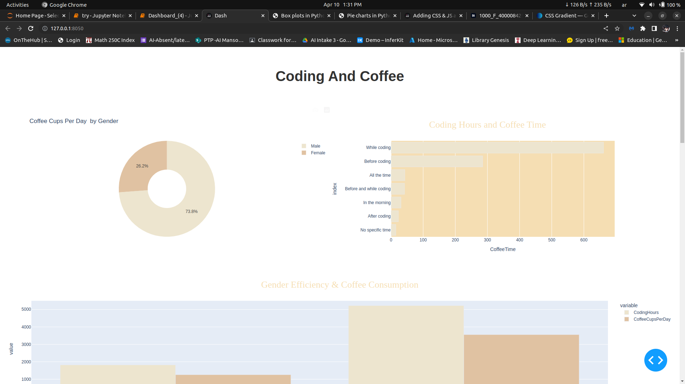
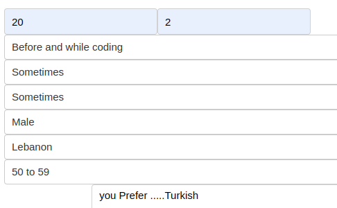

# Coffee_and_coding_visualization

## Exploratory Data Analysis
### Explaining the relation between different factors in the daily life of a programmer

## Using some feature to predict the type of coffee a programmer would like

